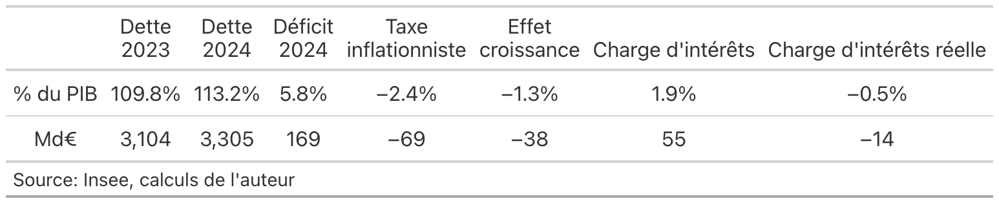

# Quelques questions sur la dette publique

## Réplication

Le dépôt contient de quoi répliquer les figures et les données de la [note en lien](https://fgeerolf.com/dette-publique.html):

### Figure 1 : Excédents primaires ou effet boule de neige ?

[Code R](figure1.R)

### Figure 2 : Charge d'intérêt vs. charge d'intérêt réelle (% du PIB)

[Code R](figure2.R)

### Figure 2b : Charge d'intérêt vs. charge d'intérêt réelle (Md€)

[Code R](figure2b.R)

### Figure 3 : Déficit public et déficit public corrigé de la « taxe inflationniste » (% du PIB)

[Code R](figure3.R)

### Table 1 : En 2024, une hausse de 3.4% du PIB du ratio dette/PIB malgré un déficit à 5.8% du PIB 

[Code R](table1.R)

